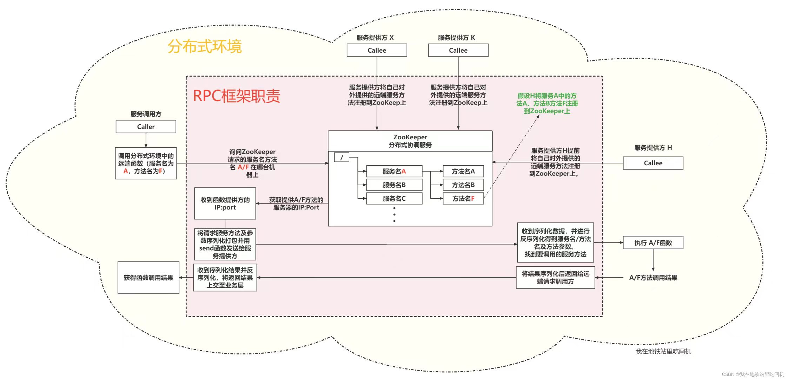

#### protobuf数据结构设计
* 包含状态码、登录请求、注册请求、登录请求结果，注册请求结果等模块
* 编译后得到的文件代码繁杂，而且若使用了grpc框架则会自动序列化，没有了序列化函数，现在来看看LrpcHeader.proto编译后的代码
* LrpcHeader.proto里面有以下字段：服务名、方法名、参数数量

#### 服务端设计
* protobuf数据结构设计完成后开始设计服务端，先明确服务端的功能是什么，客户端发送数据，服务端要接受数据，并在服务端的函数执行结果后返回给客户端，那么我的服务端一定要完成相应的函数逻辑
* 这个图片很清晰，讲述了每个模块的作用，zookeeper相当于一个中介，我的服务端把提供的服务放进去，我的客户端可以在这里调用。protobuf就是数据在传输时进行序列化操作，muduo是提供一个多线程功能。